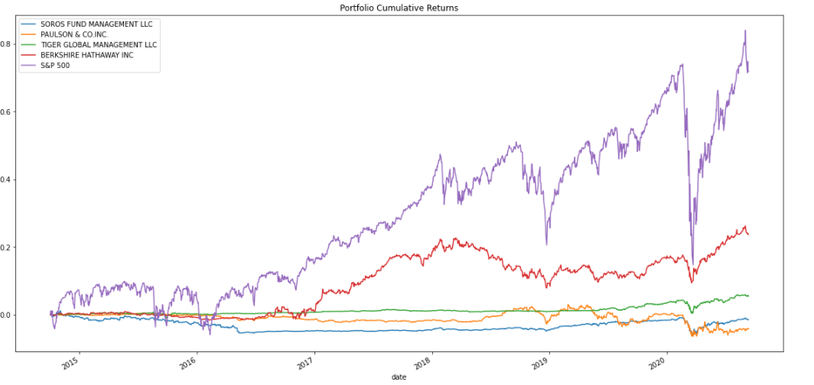
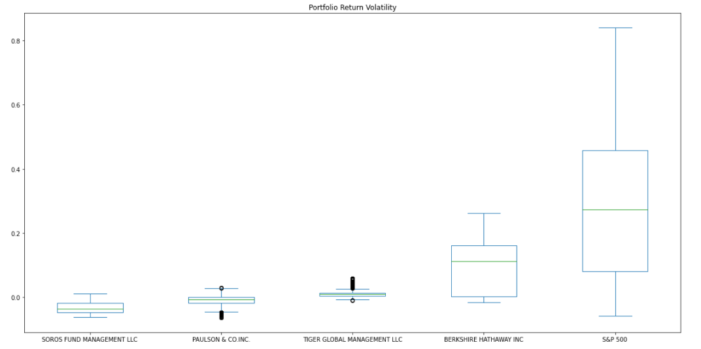
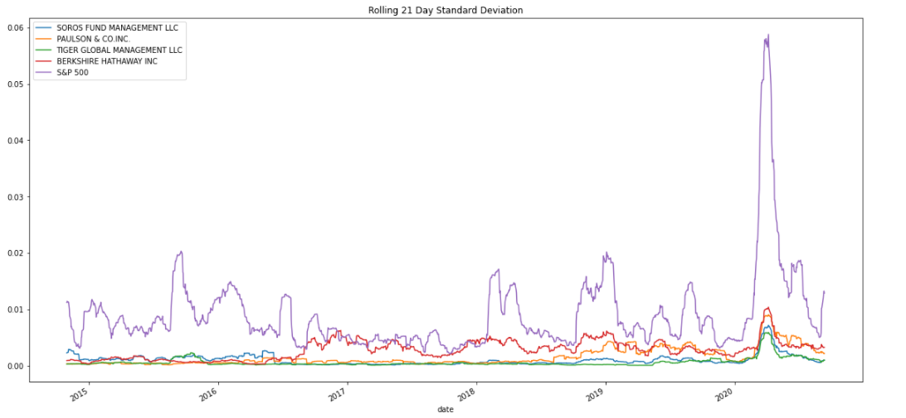
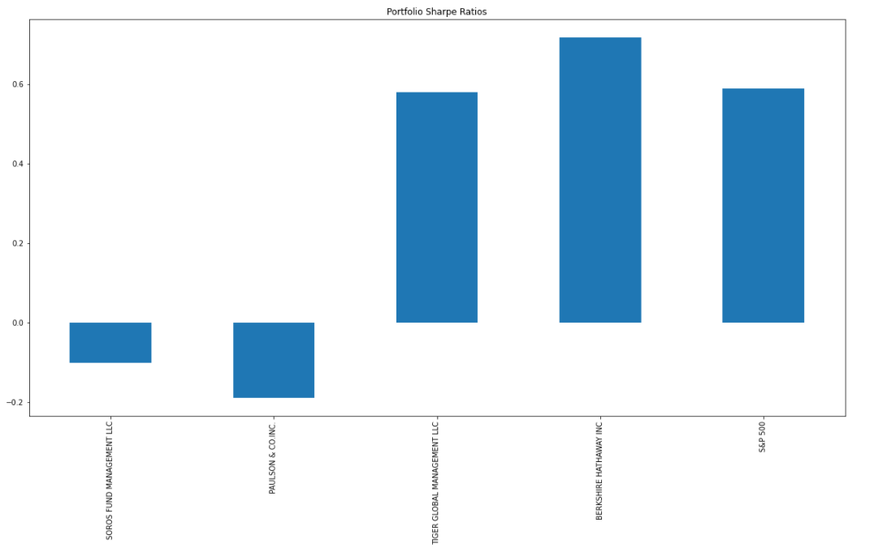
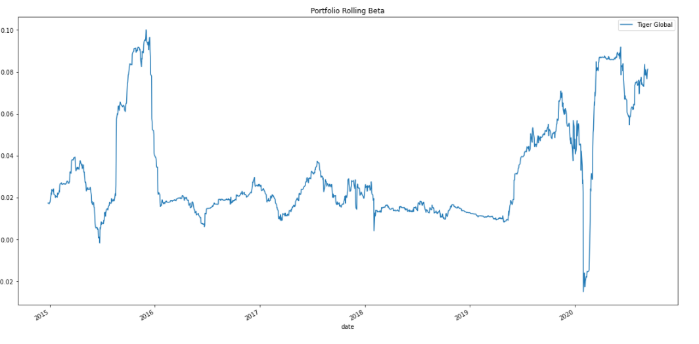
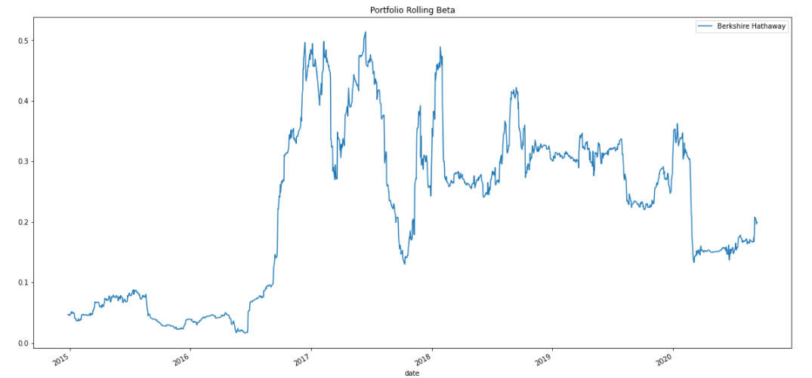

# Risk Return Analysis

This analysis is to determine which hedge fund portfolio would be the best fund to add to our firm's suite of investment fund options.

---

## Technologies

This analysis uses Python in Jupyter Lab with the following packages:

- [Pandas](https://pandas.pydata.org/) to analyze and manipulate data
- [Path](https://docs.python.org/3.7/library/pathlib.html) from pathlib library to download trading data from another file
- [%matplotlib inline](https://matplotlib.org/) in order to see visual output in notebook 

---

## Process

The performance data for the four funds were analysed to first determine how each fund has performed over time:

We then looked at historical risk and volatility utilizing box plots, and rolling standard deviation:

Combining both returns and volatility, we then calculated a Sharpe Ratio for each fund to determine which fund has performed the best on a risk-adjusted basis:

Finally, we selected the top two performing funds, and reviewed their historical beta relative to the S&P 500:

Our analysis concluded that Berkshire Hathaway would be the best fund to add to our suite of investment funds, given the much higher risk adjusted returns.

---

## Contributors

This project was created by Matt Wojichowski with the guidance of the University of Washington 2021-2022 FinTech Bootcamp Class.

[Matt Wojichowski LinkedIn](https://www.linkedin.com/in/matt-wojichowski-cfa-caia-93a34a42/)

---

## License 

MIT